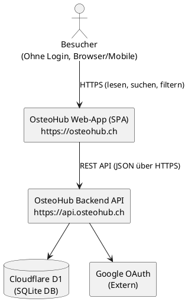
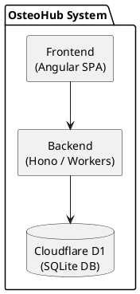
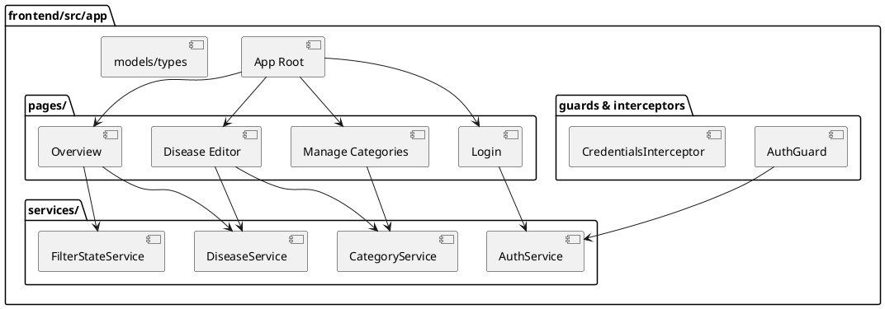
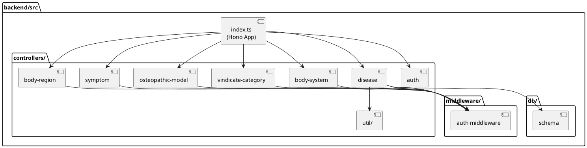
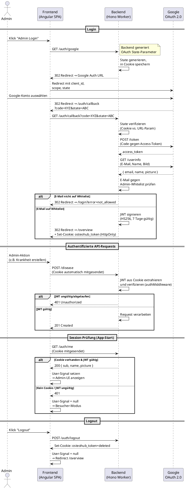
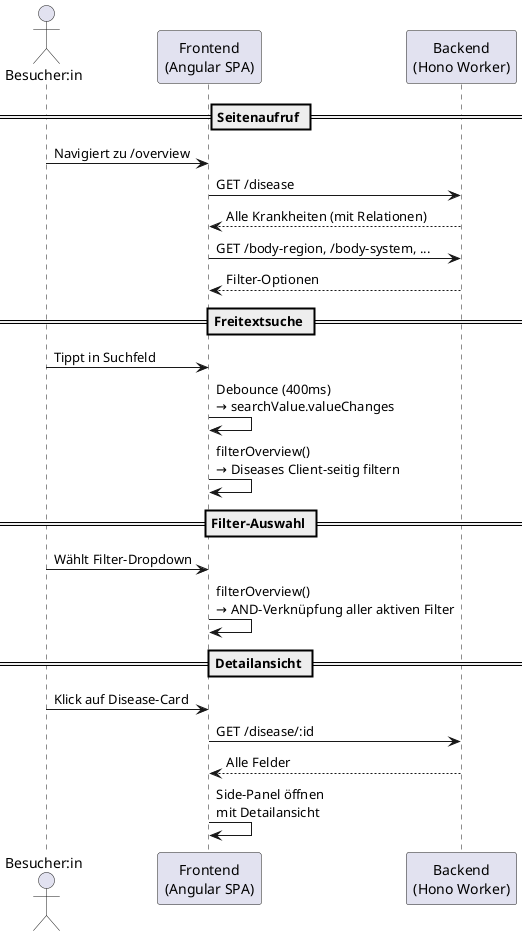
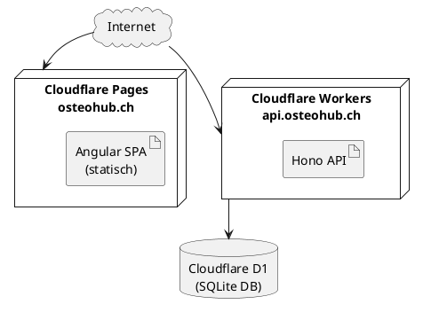
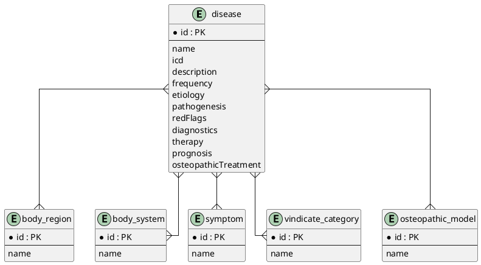
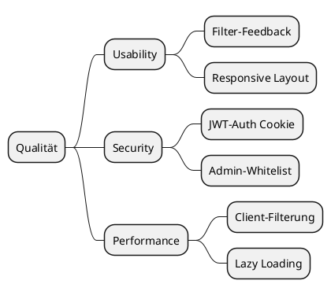

# OsteoHub - Architekturdokumentation

Dieses Dokument beschreibt die Software-Architektur von **OsteoHub** und orientiert sich an der
[arc42-Vorlage](https://www.arc42.de/overview/) (Kapitel 1-11).

---

## 1. Einführung und Ziele

### 1.1 Aufgabenstellung

OsteoHub ist eine Web-Applikation in Form einer **Krankheits- und Wissensdatenbank** für
Osteopathie-Studierende. Ziel ist es, beim Lernen und beim klinischen Denken zu unterstützen, indem
Erkrankungen strukturiert erfasst und über Filter sowie Freitextsuche schnell auffindbar gemacht
werden.

Die fachlichen Anforderungen sind in der
[Projektbeschreibung](Projektbeschreibung.md) als priorisierte User Stories
(MoSCoW) dokumentiert.

### 1.2 Qualitätsziele

| Priorität | Qualitätsziel      | Beschreibung                                                                        |
| --------- | ------------------ | ----------------------------------------------------------------------------------- |
| 1         | Usability          | Intuitive Such-/Filterbedienung; aktive Filter                                      |
| 2         | Security by Design | Schreibzugriffe serverseitig durch JWT-Middleware abgesichert, Admin-Whitelist      |
| 3         | Responsive Design  | Besucheransicht nutzbar auf Mobile, Tablet und Desktop                              |
| 4         | Performance        | Such-/Filterinteraktion fühlt sich reaktiv an (Debounce, Client-Side-Filterung)     |
| 5         | Wartbarkeit        | Klare Trennung Frontend/Backend, typisierte Schnittstellen, automatisiertes Linting |

### 1.3 Stakeholder

| Rolle                        | Erwartung                                                             |
| ---------------------------- | --------------------------------------------------------------------- |
| Osteo-Studierende (Besucher) | Krankheiten durchsuchen, filtern und Detailinformationen nachschlagen |
| Admin                        | Krankheitsprofile und Kategorien pflegen (CRUD)                       |

---

## 2. Randbedingungen

### 2.1 Technische Randbedingungen

| Randbedingung          | Beschreibung                                                                    |
| ---------------------- | ------------------------------------------------------------------------------- |
| Monorepo               | pnpm Workspace mit `frontend/` und `backend/` Packages                          |
| Frontend-Framework     | Angular 21 (SPA, Standalone Components, Signals)                                |
| Design System          | [@siemens/element-ng](https://element.siemens.io/) v49 + @siemens/element-theme |
| Backend-Framework      | Hono (lightweight, Web-Standards-basiert)                                       |
| Runtime                | Cloudflare Workers                                                              |
| Datenbank              | Cloudflare D1 (SQLite-Datenbank)                                                |
| ORM                    | Drizzle ORM (Type-Safe, SQLite-Dialekt)                                         |
| Authentifizierung      | Google OAuth 2.0 → eigenes JWT (HttpOnly Cookie)                                |
| Hosting                | Cloudflare Pages (Frontend), Cloudflare Workers (Backend API)                   |
| Package Manager        | pnpm 10                                                                         |
| Linting / Formatierung | ESLint (TypeScript + Angular Rules), Prettier, Stylelint                        |

### 2.2 Organisatorische Randbedingungen

- Einzelarbeit im Rahmen des Moduls _Web Programming Lab_
- Zeitbudget ca. 60 Stunden
- Abgabe als Git-Repository (GitHub)

### 2.3 Abweichung vom ursprünglichen Projektvorschlag

Die [Projektbeschreibung](Projektbeschreibung.md) sah ursprünglich **Firebase** als
Backend-Plattform vor (Firestore, Firebase Authentication, Firebase Security Rules, Firebase
Hosting). Während der Entwicklung wurde die Entscheidung getroffen, auf **Cloudflare
Workers + D1** zu wechseln.

**Gründe für den Wechsel:**

1. **Kostenstruktur:** Firebase verursacht bei aktivem Firestore-Gebrauch und Cloud Functions
   schnell Kosten, die für ein Studienprojekt schwer abschätzbar sind. Cloudflare Workers bieten
   ein grosszügiges Free-Tier (100'000 Requests/Tag, 5 GB - 5M Rows read/Tag D1-Storage), das für OsteoHub mehr als
   ausreicht.
2. **Relationale Datenmodellierung:** Die Datenstruktur von OsteoHub ist stark relational
   (Krankheiten ↔ Körperregionen, Symptome, VINDICATE-Kategorien etc., jeweils m:m). Firestore
   als Dokumentendatenbank hätte entweder redundante Daten oder aufwändiges Denormalisieren
   erfordert. Eine SQL-basierte Datenbank (D1/SQLite) bildet dieses Modell natürlicher ab.
3. **Backend-Kontrolle:** Mit Hono auf Cloudflare Workers kann die gesamte API-Logik
   (Validierung, Auth-Middleware, Relationen verwalten) in TypeScript geschrieben werden - deutlich
   flexibler als Firestore Security Rules.
4. **Entwickler-Erfahrung:** Der Wechsel bot die Möglichkeit, neue Web-Technologien zu
   erlernen (Cloudflare Workers, Hono, Drizzle ORM), was dem Modulziel _"Anwendung von noch nicht
   bekannten Web Technologien"_ entspricht.

Weitere evaluierte Hosting-Alternativen: Netlify, Render, DigitalOcean Functions.

---

## 3. Kontextabgrenzung

### 3.1 Fachlicher Kontext

### 3.2 Technischer Kontext

| Schnittstelle      | Protokoll / Format | Beschreibung                                        |
| ------------------ | ------------------ | --------------------------------------------------- |
| Frontend → Backend | HTTPS / JSON       | REST-Endpunkte für Krankheiten und Kategorien       |
| Backend → D1       | Drizzle ORM / SQL  | Relationale Abfragen über SQLite                    |
| Backend → Google   | HTTPS / OAuth 2.0  | Token-Exchange im Authorization Code Flow           |
| Browser → Frontend | HTTPS              | Cloudflare Pages CDN (Angular SPA)                  |
| Browser → Backend  | HTTPS (Cookie)     | JWT-Token als HttpOnly-Cookie für Authentifizierung |

---

## 4. Lösungsstrategie

### 4.1 Architekturstil

**Client-Server mit SPA-Frontend und REST-API:**

- Das Frontend ist eine Angular Single-Page-Application, die über Cloudflare Pages als statisches
  Asset ausgeliefert wird.
- Das Backend ist eine REST-API auf Cloudflare Workers, die JSON-Ressourcen bereitstellt.
- Die Kommunikation erfolgt über HTTPS mit JSON-Payloads.

### 4.2 Schlüsselentscheidungen

| Entscheidung                      | Begründung                                                                                                                                                                                                                                                                                                         |
| --------------------------------- | ------------------------------------------------------------------------------------------------------------------------------------------------------------------------------------------------------------------------------------------------------------------------------------------------------------------ |
| Angular + @siemens/element        | Angular bildet mit Signals, Standalone Components und starkem Typsystem eine robuste Basis. @siemens/element wurde bewusst eingesetzt, um die kürzlich veröffentlichte Open-Source Design-Library im Praxiseinsatz zu erproben ("Dogfooding") und ihre Nutzbarkeit als externe Entwickler:in zu validieren.        |
| Hono statt Express                | Hono ist auf Web-Standards (Request/Response) ausgelegt und läuft nativ auf Cloudflare Workers - ohne Node.js-Kompatibilitätsprobleme.                                                                                                                                                                             |
| Drizzle ORM                       | Type-Safe SQL-Queries, nativer SQLite-Dialekt-Support, leichtgewichtig und gut in Cloudflare D1 integriert. Bewusst wurde die Beta-Version (v1.0.0-beta.15) eingesetzt, da Drizzle zum Projektzeitpunkt noch kein stabiles 1.0-Release hatte, die Relational-Query-API aber bereits produktionsreif funktionierte. |
| JWT in HttpOnly-Cookie            | Kein Token im `localStorage` (XSS-sicher). Cookie wird automatisch bei API-Requests mitgesendet. `SameSite=Lax` bietet CSRF-Schutz.                                                                                                                                                                                |
| Client-seitige Filterung          | Alle Krankheiten werden initial geladen und im Browser gefiltert. Bei der erwarteten Datenmenge (< 500 Einträge) ist dies performanter und UX-freundlicher als serverseitige Paginierung.                                                                                                                          |
| Kein dediziertes Admin-UI         | Bei maximal ~5 Admin-Benutzer:innen ist ein separates Admin-Portal unverhältnismässig. Stattdessen werden Admin-Funktionen (Bearbeiten, Löschen) in der Besucheransicht ergänzt, wenn ein Admin eingeloggt ist.                                                                                                    |
| Figma-Mockups vor Implementierung | Vor der Entwicklung wurden grundlegende UI-Mockups in Figma erstellt, um Navigation, Layout und Komponenten-Struktur vorab zu klären und Design-Entscheidungen innerhalb des Element-Systems zu validieren.                                                                                                        |

---

## 5. Bausteinsicht

### 5.1 Ebene 1 - System-Übersicht

### 5.2 Ebene 2 - Frontend-Bausteine

| Baustein                | Verantwortlichkeit                                                                                                                                                                                                                              |
| ----------------------- | ----------------------------------------------------------------------------------------------------------------------------------------------------------------------------------------------------------------------------------------------- |
| **App Root**            | Root-Komponente mit Application-Header, Navigation und Router-Outlet. Konfiguriert Provider (HTTP, Router, Auth-Initialisierung).                                                                                                               |
| **pages/**              | Seitenkomponenten (Smart Components), die Datenflüsse orchestrieren und via Lazy Loading einzeln gebündelt werden. Jede Page enthält ggf. eigene Sub-Komponenten (z.B. `filter-selection/` in Overview, `category-list/` in Manage Categories). |
| **services/**           | Zentralisierte Logik für API-Kommunikation (`DiseaseService`, `CategoryService`), Auth-State-Management (`AuthService`) und globalen Filter-State (`FilterStateService`). Alle nutzen Angular Signals.                                          |
| **guards/interceptors** | `AuthGuard` schützt Admin-Routen im Router. `CredentialsInterceptor` setzt `withCredentials` für Requests an den API-Origin.                                                                                                                    |
| **models/types**        | Shared TypeScript-Typen (`Disease`, `NamedEntity`, etc.), die von Services und Komponenten gemeinsam genutzt werden.                                                                                                                            |

**Schlüsselprinzipien:**

- **Standalone Components** ohne NgModules.
- **Angular Signals** für reaktives State-Management (Auth, Filter, UI-State).
- **Lazy Loading** aller Pages via `loadComponent` für minimale initiale Bundle-Grösse.
- **Smart/Dumb-Pattern:** Pages orchestrieren Daten, Sub-Komponenten erhalten Daten über `input()` und kommunizieren über `output()`.

### 5.3 Ebene 2 - Backend-Bausteine

| Baustein         | Verantwortlichkeit                                                                                                                                                                                                                                             |
| ---------------- | -------------------------------------------------------------------------------------------------------------------------------------------------------------------------------------------------------------------------------------------------------------- |
| **index.ts**     | Einstiegspunkt der Hono-App. Konfiguriert CORS und mountet alle Controller-Router.                                                                                                                                                                             |
| **controllers/** | Je ein Hono-Router pro Ressource (Disease, Body Region, Body System, etc.). Der Auth-Controller verwaltet den Google OAuth Flow, JWT-Ausgabe und Session-Management. `util/` enthält gemeinsame Hilfslogik für Validierung, Mapping und Relationen-Management. |
| **middleware/**  | JWT-Verifizierung (Cookie-basiert). Schützt alle schreibenden Endpunkte (POST, PUT, PATCH, DELETE); lesende Endpunkte (GET) sind öffentlich.                                                                                                                   |
| **db/**          | Drizzle-ORM-Schema mit Tabellendefinitionen, Relationen und Indizes. Daraus werden automatisch SQL-Migrationen generiert.                                                                                                                                      |

**Schlüsselprinzipien:**

- **Controller-Pattern:** Jede Ressource hat einen eigenen Hono-Router, der in `index.ts` gemountet wird.
- **Validierung:** Request-Bodies werden durch Type-Guard-Funktionen validiert, bevor sie verarbeitet werden.
- **Relationen-Management:** m:m-Relationen werden in Batch-Operationen verwaltet (alte löschen, neue einfügen).

---

## 6. Laufzeitsicht

### 6.1 Authentifizierung - Google OAuth + JWT Flow

Das folgende Diagramm zeigt den vollständigen Authentifizierungsablauf:

**Sicherheitsmerkmale des Auth-Flows:**

- **OAuth State-Parameter:** Schutz gegen CSRF bei der Anmeldung. Ein zufälliger 32-Byte-Wert wird
  im Cookie gespeichert und mit dem URL-Parameter abgeglichen.
- **HttpOnly-Cookie:** Das JWT ist nicht über JavaScript zugreifbar (XSS-Schutz).
- **SameSite=Lax:** Der Cookie wird nur bei Top-Level-Navigationen und Same-Site-Requests
  gesendet (CSRF-Schutz).
- **Secure-Flag:** In Produktion wird der Cookie nur über HTTPS gesendet.
- **Domain-Scoping:** In Produktion ist der Cookie auf `.osteohub.ch` beschränkt, sodass er sowohl
  für `osteohub.ch` als auch `api.osteohub.ch` gilt.
- **Admin-Whitelist:** Auch nach erfolgreicher Google-Authentifizierung wird die E-Mail gegen eine
  serverseitige Whitelist geprüft (`ALLOWED_EMAILS` in Wrangler-Konfiguration).

### 6.2 Krankheiten suchen und filtern

Die Suchfunktion durchsucht: Name, Beschreibung, Körperregionen, Körpersysteme,
VINDICATE-Kategorien, osteopathische Modelle und Symptome.

Filter aus verschiedenen Kategorien werden mit **AND** verknüpft (z.B. Körperregion=Thorax UND
System=Kardiovaskulär). Innerhalb einer Kategorie gilt **OR** (z.B. Thorax ODER Abdomen).

---

## 7. Verteilungssicht

| Knoten          | Technologie        | Deployment                                                          |
| --------------- | ------------------ | ------------------------------------------------------------------- |
| osteohub.ch     | Cloudflare Pages   | Automatisch via GitHub-Integration (main Branch)                    |
| api.osteohub.ch | Cloudflare Workers | Automatisch via GitHub-Integration (main Branch) oder `pnpm deploy` |
| D1 Datenbank    | Cloudflare D1      | Migrationen via `pnpm db:apply:remote`                              |

**Lokale Entwicklung:**

- Frontend: `pnpm frontend:start` (Port 4200)
- Backend: `pnpm backend:start` (Port 8787) mit lokaler D1-Instanz (SQLite-Datei)
- Migrationen: `pnpm backend:db:apply:local`
- Seed-Daten: `pnpm backend:db:seed:local`

> Siehe [README.md](README.md) für detaillierte Anweisungen zum Setup und Deployment.

---

## 8. Querschnittliche Konzepte

### 8.1 Datenmodell

Das relationale Schema nutzt eine Stern-artige Struktur rund um die zentrale Tabelle `disease`:

Alle Beziehungen zwischen `disease` und den Kategorie-Tabellen sind **m:m** und werden über
Zwischentabellen (Join-Tables) mit zusammengesetzten Primärschlüsseln abgebildet:

- `disease_body_region`
- `disease_body_system`
- `disease_symptom`
- `disease_vindicate_category`
- `disease_osteopathic_model`

Jede Zwischentabelle hat Indizes auf beiden Fremdschlüsseln für performante Abfragen.

Das Schema wird mit **Drizzle ORM** in TypeScript definiert (`backend/src/db/schema.ts`), woraus
automatisch SQL-Migrationen generiert werden.

### 8.2 Bewusster Verzicht auf Audit-Felder (createdAt/updatedAt)

Die ursprüngliche Projektbeschreibung sah `createdAt`/`createdBy` und `updatedAt`/`updatedBy`
Felder vor. Nach Abwägung wurde bewusst darauf verzichtet:

- **Geringe Admin-Anzahl:** OsteoHub wird realistisch von maximal 3-5 Personen administriert.
  Bei dieser Grössenordnung bieten Audit-Felder auf Datenbankebene keinen praktischen Mehrwert.
- **Cloudflare Observability:** Cloudflare Workers bieten integrierte Logs und Traces, über die
  alle API-Aufrufe (inkl. Zeitstempel und Kontext) nachvollzogen werden können - ein dediziertes
  Auditing auf Datenbankebene dupliziert diese Information.
- **Komplexitätsreduktion:** Weniger Felder im Schema bedeuten schlankere Validierung, einfachere
  Migrationen und weniger Fehlerquellen.

### 8.3 CORS-Konfiguration

Die CORS-Policy ist restriktiv konfiguriert:

- **Produktion:** Nur `https://osteohub.ch` und `https://www.osteohub.ch` sind zugelassen.
- **Entwicklung:** Zusätzlich `http://localhost:4200`.
- **Credentials:** `credentials: true` erlaubt das Mitsenden von Cookies (für JWT-Auth).
- **Methoden:** Nur GET, POST, PUT, PATCH, DELETE, OPTIONS.

### 8.4 Error-Handling

**Backend:** Strukturierte JSON-Fehler mit passenden HTTP-Statuscodes:

- `400` - Ungültige Request-Daten (fehlende Felder, ungültige IDs)
- `401` - Nicht authentifiziert (fehlender/ungültiger JWT)
- `404` - Ressource nicht gefunden
- `422` - Referenzierte IDs existieren nicht in der Datenbank
- `500` - Interner Fehler

**Frontend:** Alle Service-Fehler werden über [`SiToastNotificationService`](https://element.siemens.io/components/status-notifications/toast-notification/#toast-notification) als
Toast-Benachrichtigung dargestellt, mit kontextspezifischen Meldungen (z.B. "Keine Berechtigung"
bei 401/403 vs. generische Fehlermeldung).

### 8.5 Validierung

Die Validierung erfolgt auf zwei Ebenen:

1. **Frontend (Angular Reactive Forms):** Pflichtfeld-Validierung mit `Validators.required`,
   Custom-Validierung für Multi-Select-Felder (mindestens eine Auswahl pro Kategorie).
   Fehlermeldungen werden über den `formErrorMapper` von Element-ng dargestellt.

2. **Backend (Type Guards):** Umfassende Validierung über Type-Guard-Funktionen
   (`isDiseaseWriteBody`), die prüfen:
   - Alle String-Felder sind nicht-leer nach Trimming
   - Alle ID-Arrays enthalten gültige positive Integer ohne Duplikate
   - Referenzierte IDs existieren tatsächlich in der Datenbank (via Batch-Query)

### 8.6 Design System - @siemens/element

Die Wahl von [**@siemens/element**](https://element.siemens.io/) als Design System erfolgte aus einer spezifischen Motivation:
Als Mitarbeiter am Element-Projekt wurde die kürzlich veröffentlichte Open-Source-Variante der
Design-Library bewusst im Praxiseinsatz erprobt ("Dogfooding"). Ziel war es, die Nutzbarkeit des
Open-Source-Pakets (@siemens/element-theme + @siemens/element-ng) als externe:r Entwickler:in zu
validieren - insbesondere, weil intern zusätzliche, nicht quelloffene Pakete existieren.

Das Element Theme stellt zudem CSS-Utility-Klassen und Design-Tokens bereit (Farben, Abstände,
Typografie), die durchgängig genutzt werden.

### 8.7 UI-Prototyping mit Figma

Vor der Implementierung wurden grundlegende Mockups in **Figma** erstellt, um:

- Die Navigation und das Seitenlayout zu planen
- Das List-Detail-Pattern (Cards + Side-Panel) vorab zu validieren
- Die Responsive-Strategie (Mobile Filter-Collapse, Grid-Anpassung) besser zu visualisieren und schlussendlich zu definieren

Die Figma-Mockups dienten als Leitfaden, nicht als pixel-genaue Vorlage. Die finale
Implementierung orientiert sich an den Element-Komponenten und deren Empfehlungen.

Die exportierten Mockups befinden sich unter `docs/imgs/` (`UI-Exploration.png`, `List-Details-Approach.png`).
Da diese eher explorations als ausführliche UI-Spezifikationen darstellen, wird in der
Dokumentation nicht weiter darauf eingegangen.

### 8.8 Testing

**Tooling:** Vitest 4 als Test-Runner. Die Tests
laufen in einem echten Browser (Chrome/ChromeHeadless via `@vitest/browser-webdriverio`), nicht in
jsdom — dadurch sind DOM-Interaktionen und Element-Komponenten realistisch testbar. Code-Coverage
wird mit `@vitest/coverage-v8` gemessen.

**Testumfang Frontend (13 Spec-Files):**

| Kategorie  | Testdateien                                                              |
| ---------- | ------------------------------------------------------------------------ |
| Services   | `AuthService`, `DiseaseService`, `CategoryService`, `FilterStateService` |
| Pages      | `Overview`, `DiseaseEditor`, `ManageCategories`, `Login`                 |
| Components | `DiseaseCard`, `DiseaseDetails`, `CategoryList`, `FilterSelection`       |
| Root       | `AppComponent`                                                           |

Die Tests decken primär Komponenteninitialisierung, Service-Interaktionen (mit HTTP-Mocks) und
Signal-basiertes State-Management ab.

**Bewusste Entscheidung: Keine Backend-Tests.**
Die API-Controller wurden nicht mit automatisierten Tests abgedeckt. Dies war eine pragmatische
Entscheidung: Der Backend-Code ist vergleichsweise dünn (CRUD-Operationen + Auth-Flow). Als technische Schuld ist
dies in Kapitel 11 dokumentiert.

**Keine E2E-Tests.** Auf End-to-End-Tests (z.B. Playwright) wurde verzichtet. Hauptsächlich wurden aus Zeitgründen
die E2E-Tests nicht implementiert.

---

## 9. Architekturentscheidungen

### ADR-1: Client-seitige Filterung statt serverseitiger Suche

**Kontext:** Krankheiten können nach 5 Kategorietypen gefiltert und per Freitext durchsucht werden.

**Entscheidung:** Alle Krankheiten (mit Relationen) werden beim Laden der Übersichtsseite einmalig
via `GET /disease` geladen. Anschliessend wird ausschliesslich Client-seitig gefiltert.

**Begründung:**

- Die erwartete Datenmenge liegt bei unter 500 Krankheiten.
- Client-seitige Filterung bietet unmittelbares Feedback ohne Netzwerk-Latenz.
- Debounce (400ms) auf dem Suchfeld verhindert übermässiges Re-Rendering.
- Weniger API-Calls reduzieren die Worker-Nutzung im Cloudflare-Free-Tier.

**Konsequenz:** Bei sehr vielen Einträgen müsste auf serverseitige Suche mit Paginierung
umgestellt werden.

### ADR-2: JWT in HttpOnly-Cookie statt Bearer-Token

**Kontext:** Authentifizierte API-Requests müssen den Admin identifizieren.

**Entscheidung:** Das JWT wird in einem HttpOnly-Cookie gespeichert, nicht als Bearer-Token im
`Authorization`-Header.

**Begründung:**

- HttpOnly-Cookies sind nicht via `document.cookie` oder JavaScript zugreifbar → XSS-Schutz.
- `SameSite=Lax` bietet CSRF-Grundschutz.
- Cookies werden automatisch bei Requests an `api.osteohub.ch` mitgesendet - kein manuelles
  Token-Management im Frontend nötig.
- Der `credentialsInterceptor` setzt `withCredentials: true` nur für Requests an den API-Origin.

### ADR-3: Kein separates Admin-UI

**Kontext:** Admins müssen Krankheiten und Kategorien verwalten können.

**Entscheidung:** Admin-Funktionen werden in der bestehenden Besucheransicht ergänzt, statt ein
separates Admin-Portal zu bauen.

**Begründung:**

- Maximal 3-5 Admin-Benutzer:innen → ein separates Portal ist unverhältnismässig.
- Die `AuthService.isLoggedIn()`-Signal steuert, welche UI-Elemente sichtbar sind
  (z.B. Bearbeiten/Löschen-Buttons, Navigationslinks).
- Admin-Routen (`/disease-editor`, `/manage-categories`) sind durch einen `authGuard`
  geschützt und im Router nur für eingeloggte Admins zugänglich.
- Die Sicherheit liegt serverseitig: Alle schreibenden Endpunkte erfordern ein gültiges JWT.

---

## 10. Qualitätsanforderungen

### 10.1 Qualitätsbaum

### 10.2 Qualitätsszenarien

#### Usability

| ID  | Szenario                                                                                                                                                                                | Umgesetzt |
| --- | --------------------------------------------------------------------------------------------------------------------------------------------------------------------------------------- | --------- |
| U-1 | Besucher tippt einen Suchbegriff → Ergebnisliste aktualisiert sich nach 400ms Debounce, ohne Button-Klick                                                                               | Ja        |
| U-2 | Besucher wählt eine Filterkategorie aus → Ergebnisse sofort eingegrenzt; aktive Filter sind im Dropdown-Feld sichtbar                                                                   | Ja        |
| U-3 | Besucher klickt "Filter zurücksetzen" → alle Filter und die Suche werden zurückgesetzt, volle Liste erscheint                                                                           | Ja        |
| U-4 | Besucher klickt auf eine Krankheitskarte → Side-Panel öffnet sich mit vollständiger Detailansicht                                                                                       | Ja        |
| U-5 | Admin führt eine Schreibaktion aus (Erstellen, Bearbeiten, Löschen) → Toast-Benachrichtigung bestätigt Erfolg oder beschreibt den Fehler; Löschaktionen zeigen einen Bestätigungsdialog | Ja        |
| U-6 | Daten werden geladen → Skeleton-Platzhalter werden während des Ladens angezeigt - Sehr wichtig für cold starts; Fehlerzustände zeigen informativen Empty-State mit Retry-Button         | Ja        |

#### Responsive Design

| ID  | Szenario                                                                                                   | Umgesetzt |
| --- | ---------------------------------------------------------------------------------------------------------- | --------- |
| R-1 | Besucheransicht auf Desktop (>1200px) → Krankheitskarten in 3-Spalten-Grid                                 | Ja        |
| R-2 | Besucheransicht auf Tablet (768-1200px) → Karten in 2-Spalten-Grid                                         | Ja        |
| R-3 | Besucheransicht auf Mobile (<576px) → Karten in Einzelspalte, Filter als CollapsiblePanel zusammengeklappt | Ja        |
| R-4 | Side-Panel ist geöffnet (Desktop) → Grid passt sich dynamisch an (von 3 auf 2 Spalten)                     | Ja        |
| R-5 | Element Application-Header → Responsive Navigation mit Account-Dropdown und Theme-Toggle                   | Ja        |

Die responsive Anpassung der Filter-Sektion geschieht über `SiResizeObserverDirective`, die die
aktuelle Container-Breite misst und unterhalb eines Breakpoints (576px) auf die Mobile-Variante
umschaltet.

#### Performance

| ID  | Szenario                                                                                                                                                                   | Umgesetzt |
| --- | -------------------------------------------------------------------------------------------------------------------------------------------------------------------------- | --------- |
| P-1 | Freitextsuche mit < 500 Einträgen → Filterung erfolgt Client-seitig in unter 20ms (ein Frame), kein Netzwerk-Request nötig                                                 | Ja        |
| P-2 | Suchfeld-Eingabe → 400ms Debounce verhindert unnötige Rerenders beim Tippen                                                                                                | Ja        |
| P-3 | Initiales Laden → Angular Lazy Loading: nur die aktive Seite wird geladen (Overview, Editor, Login werden separat gebündelt)                                               | Ja        |
| P-4 | Cloudflare Workers nutzen V8 Isolates statt Container → Startup in <5ms (quasi kein Cold-Start im Vergleich zu klassischem Serverless wie AWS Lambda oder Cloud Functions) | Ja        |
| P-5 | Datenbankabfragen → Drizzle Relational Queries mit Indizes auf allen Fremdschlüsseln der Join-Tabellen                                                                     | Ja        |

**Messmethode:** Die Client-seitige Filterung kann über die Browser-DevTools (Performance-Tab)
gemessen werden.

#### Security

| ID  | Szenario                                                                                                        | Umgesetzt |
| --- | --------------------------------------------------------------------------------------------------------------- | --------- |
| S-1 | Nicht-authentifizierter Request an POST/PUT/DELETE → Backend antwortet mit 401                                  | Ja        |
| S-2 | Authentifizierter Request mit gültigem JWT → Backend verarbeitet den Request                                    | Ja        |
| S-3 | Google-Login mit E-Mail nicht auf Whitelist → Redirect auf Login-Seite mit Fehlermeldung "not_allowed"          | Ja        |
| S-4 | JWT im HttpOnly-Cookie → Nicht via JavaScript zugreifbar (XSS-Schutz)                                           | Ja        |
| S-5 | CORS → Nur registrierte Origins können Requests mit Cookies senden                                              | Ja        |
| S-6 | OAuth State-Parameter → Schutz gegen CSRF bei der Anmeldung                                                     | Ja        |
| S-7 | Frontend Auth-Guard → Admin-Routen sind im Router geschützt (UX, nicht Security); Sicherheit liegt serverseitig | Ja        |
| S-8 | Request-Validierung → Type Guards und ID-Existenzprüfungen vor Datenbank-Schreiboperationen                     | Ja        |

#### Accessibility (a11y)

| ID  | Massnahme                                                                                         | Status          |
| --- | ------------------------------------------------------------------------------------------------- | --------------- |
| A-1 | Element-Komponenten liefern ARIA-Attribute und Keyboard-Navigation von Haus aus                   | Umgesetzt       |
| A-2 | `aria-label` auf interaktiven Elementen (Header-Buttons, Action-Items)                            | Umgesetzt       |
| A-3 | `labelledby` auf allen Filter-Select-Elementen für Screen-Reader-Zuordnung                        | Umgesetzt       |
| A-4 | Semantische Struktur: `<main>`, `<h1>`-`<h5>`, `<nav>` (via Application-Header)                   | Umgesetzt       |
| A-5 | Farbkontraste entsprechen den Element-Design-Tokens (WCAG-konform durch das Theme-System)         | Über Theme      |
| A-6 | Vollständige Keyboard-Navigation aller Workflows (Suche, Filter, Erstellen, Bearbeiten, Löschen)  | Teilweise       |
| A-7 | Screen-Reader-Announcements für dynamische Inhalte (Side-Panel-Öffnung, Toast-Benachrichtigungen) | Über Element-ng |

Accessibility wird in erster Linie durch die Nutzung des Element Design Systems gewährleistet, das
ARIA-Rollen und Keyboard-Interaktion in allen Komponenten integriert hat. Zusätzlich wurden
explizite `aria-label` und `labelledby`-Attribute dort gesetzt, wo Custom-HTML verwendet wird.
Als Verbesserungspotenzial bleibt die vollständige Keyboard-Testabdeckung in allen Flows.

---

## 11. Risiken und technische Schuld

| Risiko / Schuld                                 | Beschreibung                                                           | Massnahme / Konsequenz                                           |
| ----------------------------------------------- | ---------------------------------------------------------------------- | ---------------------------------------------------------------- |
| Client-seitige Filterung bei grosser Datenmenge | Bei > 500 Einträgen könnte die Filterung spürbar langsamer werden      | Serverseitige Suche mit Paginierung als Fallback vorsehen        |
| Keine Backend-Tests                             | Die API-Logik hat aktuell keine automatisierten Tests                  | Hono bietet Testing-Utilities; Tests könnten nachgerüstet werden |
| Kein Offline-Support                            | Die SPA benötigt eine aktive Internetverbindung                        | Für eine Lern-App akzeptabel                                     |
| Audit-Felder (createdAt/updatedAt) fehlen       | Die Projektbeschreibung sah diese vor; bewusst weggelassen (siehe 8.2) | Cloudflare Logs bieten die Nachvollziehbarkeit                   |
| Single-Point-of-Failure: Cloudflare             | Sowohl Frontend, Backend als auch Datenbank laufen auf Cloudflare      | Für ein Studienprojekt akzeptabel; Cloudflare hat hohe SLAs      |
| JWT-Ablauf: 7 Tage, kein Refresh-Token          | Lang-lebige Sessions ohne explizites Renewal                           | Für < 5 Admins tragbar; bei Bedarf Token-Rotation einführen      |

---

## Glossar

| Begriff                | Bedeutung                                                                                                                   |
| ---------------------- | --------------------------------------------------------------------------------------------------------------------------- |
| VINDICATE              | Lern-Akronym zur systematischen Einordnung von Krankheitsursachen (z.B. Vaskulär, Infektiös, Degenerativ, Traumatisch etc.) |
| Osteopathisches Modell | Perspektive der osteopathischen Betrachtung (Biomechanisch, Neurologisch, etc.)                                             |
| D1                     | Cloudflare's verteilte SQLite-Datenbank, eingebunden in Workers                                                             |
| Hono                   | Leichtgewichtiges Web-Framework für Edge-Runtimes (Cloudflare Workers, Deno, Bun)                                           |
| Drizzle ORM            | Type-Safe ORM für TypeScript mit SQLite-Dialekt-Support                                                                     |
| Dogfooding             | Eigene Produkte im Alltag nutzen, um Qualität und Nutzbarkeit zu validieren                                                 |
